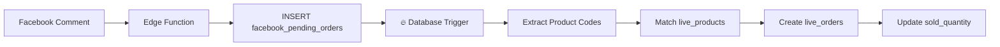

# Auto-Create Live Orders từ Facebook Comments

## Tổng quan
Hệ thống này tự động tạo `live_orders` ngay lập tức khi có Facebook comment được lưu vào `facebook_pending_orders` thông qua **Database Trigger**.

## Kiến trúc



## Cách hoạt động

### 1. Trigger tự động
Khi có record mới trong `facebook_pending_orders`:
- ✅ Trigger `trigger_auto_create_live_orders` tự động kích hoạt
- ✅ Extract mã sản phẩm từ `comment` field (N55, N236L, v.v.)
- ✅ Tìm `live_products` matching với hôm nay (`phase_date`)
- ✅ Tạo `live_orders` cho mỗi sản phẩm match
- ✅ Update `sold_quantity` tự động
- ✅ Detect oversell dựa trên `sold_quantity` vs `prepared_quantity`

### 2. Ưu điểm
- ⚡ **Real-time**: Không cần polling từ frontend
- 🎯 **Accurate**: Xử lý ngay trong database, tránh race condition
- 🔒 **Reliable**: Database transaction đảm bảo consistency
- 📊 **Audit trail**: Logs trong database function

### 3. Edge cases được xử lý
- ✅ Comment không có mã sản phẩm → Skip
- ✅ Mã sản phẩm không tìm thấy trong `live_products` → Log warning
- ✅ Trùng lặp (duplicate) → Check `facebook_comment_id` + `live_product_id`
- ✅ Nhiều mã sản phẩm trong 1 comment → Tạo nhiều orders

## Cài đặt

### Bước 1: Chạy Migration
```bash
# Trong Supabase SQL Editor, chạy file:
auto_create_live_orders_trigger.sql
```

### Bước 2: Verify
```sql
-- Check function đã tạo
SELECT proname FROM pg_proc WHERE proname = 'auto_create_live_orders_from_pending';

-- Check trigger đã active
SELECT tgname, tgtype, tgenabled 
FROM pg_trigger 
WHERE tgname = 'trigger_auto_create_live_orders';

-- Test extract function
SELECT extract_product_codes('Test N55 and N236L with N217');
-- Expected: {N55, N236L, N217}
```

### Bước 3: Test
```sql
-- Insert test record
INSERT INTO facebook_pending_orders (
  facebook_comment_id,
  comment,
  customer_name,
  session_index
) VALUES (
  'test_comment_123',
  'Đặt N55 và N236L nhé',
  'Test Customer',
  '001'
);

-- Check live_orders created
SELECT * FROM live_orders WHERE facebook_comment_id = 'test_comment_123';

-- Check sold_quantity updated
SELECT product_code, sold_quantity 
FROM live_products 
WHERE phase_date = CURRENT_DATE;
```

## Monitoring

### View Logs
```sql
-- Trigger logs sẽ hiển thị trong Supabase Logs
-- Hoặc check via SQL:
SELECT * FROM pg_stat_user_functions 
WHERE funcname = 'auto_create_live_orders_from_pending';
```

### Debugging
Nếu có lỗi, check:
1. `facebook_pending_orders` có record mới không?
2. `live_products` có sản phẩm với mã matching không?
3. `phase_date` có đúng với hôm nay không?

## Rollback

### Disable Trigger tạm thời
```sql
ALTER TABLE facebook_pending_orders DISABLE TRIGGER trigger_auto_create_live_orders;
```

### Re-enable Trigger
```sql
ALTER TABLE facebook_pending_orders ENABLE TRIGGER trigger_auto_create_live_orders;
```

### Drop Trigger hoàn toàn
```sql
DROP TRIGGER IF EXISTS trigger_auto_create_live_orders ON facebook_pending_orders;
DROP FUNCTION IF EXISTS auto_create_live_orders_from_pending();
DROP FUNCTION IF EXISTS extract_product_codes(TEXT);
```

## Frontend Hook (Deprecated)

Hook `useProcessPendingOrders` đã được **DISABLED** vì trigger đã xử lý tự động.

Nếu cần re-enable làm backup mechanism:
```typescript
// Trong src/hooks/use-process-pending-orders.ts
// Uncomment phần useEffect đã comment
```

## So sánh với cách cũ

| Feature | Cách cũ (Frontend Hook) | Cách mới (Database Trigger) |
|---------|------------------------|----------------------------|
| **Timing** | Polling mỗi 30s | Instant (real-time) |
| **Performance** | Frontend phải query | Database internal |
| **Reliability** | Phụ thuộc page load | Always active |
| **Race conditions** | Có thể xảy ra | Không có (transaction) |
| **CPU usage** | Frontend CPU | Database CPU |
| **Scalability** | Mỗi user 1 polling | 1 trigger cho tất cả |

## Maintenance

### Thêm mã sản phẩm pattern mới
Nếu cần support pattern khác (ví dụ: `P123`), update regex:
```sql
-- Trong function extract_product_codes
-- Thay: (N\d+[A-Z]*)
-- Bằng: ([NP]\d+[A-Z]*)
```

### Thêm logic custom
Update function `auto_create_live_orders_from_pending()` trong migration file.

## Support
Nếu có vấn đề:
1. Check Supabase Logs
2. Run verification queries ở trên
3. Test với data mẫu
4. Rollback về cách cũ nếu cần

---

**Lưu ý**: Sau khi chạy migration, frontend hook sẽ tự động disabled. Trigger sẽ xử lý 100% việc tạo orders.
